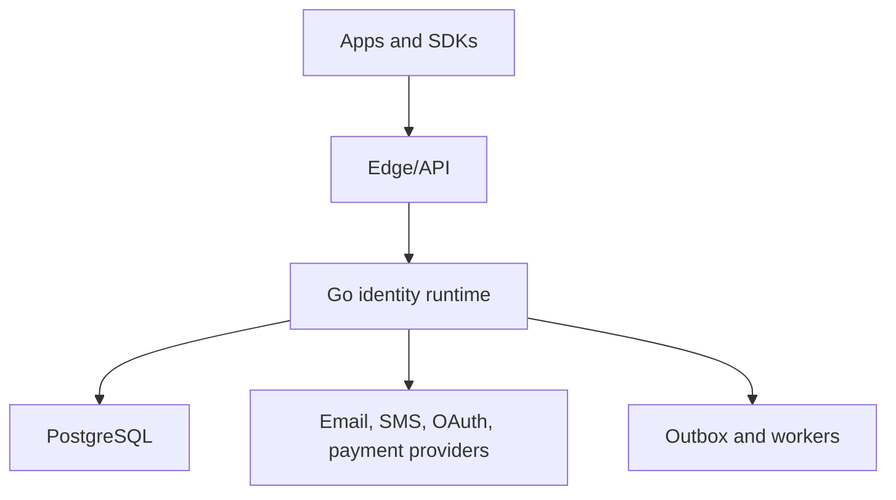

# BeeBox Repository Instructions

> Status: engineering constitution and delivery plan for a greenfield repository.  
> Product benchmark reviewed: Clerk public documentation on 2026-08-16.  
> Applies to every human, AI agent, branch, pull request, service, SDK, migration, and deployment in this repository unless a newer accepted ADR explicitly overrides a section.

## 1. Product definition

BeeBox is an open-source, developer-first identity and access platform written primarily in Go. It aims to provide the product capabilities developers expect from Clerk—authentication, user and session management, organizations, authorization, machine identities, webhooks, administration, and billing entitlements—through BeeBox-owned contracts and implementation.

“Clerk clone” means **public capability parity as a product benchmark**, not source-code, API, UI, documentation, trademark, asset, or proprietary-behavior copying. BeeBox must have its own naming, contracts, threat model, implementation, design system, and release policy.

### Goals

- Secure defaults for B2C and B2B identity flows.
- A fast local setup and a clear self-hosting path.
- Stable, versioned APIs and SDKs with excellent Go support first.
- Headless APIs plus optional prebuilt UI components.
- Strong tenant isolation, auditability, observability, and migration safety.
- A codebase that can evolve from one deployable into bounded-context services without a rewrite.

### Non-goals for the initial releases

- Bit-for-bit or endpoint-for-endpoint compatibility with Clerk.
- A microservice per feature, function, endpoint, or database table.
- Kubernetes, Kafka, service mesh, event sourcing, CQRS, or multi-region active-active before measured demand.
- Building every SDK and social/enterprise provider before the core contracts stabilize.
- Inventing cryptography or authentication protocols.

## 2. Architecture decision: modular monolith first, microservices by evidence

BeeBox uses a **microservice-ready modular monolith** for the first production releases. The initial system is one Go deployable with strict bounded-context package boundaries. This is intentional: authentication needs atomic state transitions, a small team needs short feedback loops, and premature network boundaries multiply consistency, latency, security, testing, and operational failure modes.

“Use microservices” is satisfied as an evolutionary target, not by creating empty services on day one. A module may be extracted only when an ADR provides evidence for at least one of these drivers:

- materially different scale or latency profile;
- independent ownership and release cadence;
- security/compliance isolation;
- availability or blast-radius isolation;
- a stable contract and a clear single owner for its data.

The ADR must also define API/event contracts, data ownership, SLOs, timeouts, retry/idempotency semantics, deployment order, observability, incident ownership, migration, and rollback. Extracted services must not share mutable table ownership. Cross-service workflows use explicit APIs and, when asynchronous delivery is justified, transactional outbox/inbox plus idempotent consumers. Distributed transactions are forbidden.



Likely future extraction order, only after the criteria above are met:

1. Notification delivery and webhook dispatch workers.
2. Audit/log ingestion and retention.
3. Machine authentication/token verification if its traffic profile diverges.
4. Billing entitlements and payment orchestration.
5. Core identity, authentication, and sessions last because their consistency boundary is tightly coupled.

## 3. Clean Architecture rules

Clean Architecture is a dependency rule, not a folder-count target.

- **Domain:** entities, value objects, policies, state machines, and invariants. No HTTP, SQL, queue, vendor SDK, environment, or framework imports.
- **Application:** use cases and orchestration. Depends on domain and narrow ports. Owns transaction intent, authorization intent, and stable application errors.
- **Ports:** interfaces only at real I/O, clock/random/crypto, or provider boundaries. Do not create an interface for every struct.
- **Adapters:** HTTP/gRPC handlers, PostgreSQL repositories, Redis, email/SMS/OAuth/payment providers, queues, and telemetry.
- **Composition:** process startup, dependency wiring, config validation, lifecycle, migrations, and graceful shutdown.

Dependency direction is always inward. Domain and application code must not import adapter packages. Public API/event models do not double as database models. Vendor types never cross a BeeBox public boundary.

Recommended initial layout:

```text
cmd/beebox/                   process entrypoint
internal/platform/           config, database, telemetry, HTTP, crypto primitives
internal/identity/           users, identifiers, profiles, metadata
internal/authentication/     sign-up/sign-in, verification, factors, recovery
internal/session/            clients, sessions, tokens, devices, revocation
internal/organization/       organizations, memberships, invitations, domains
internal/authorization/      roles, permissions, policy and entitlement checks
internal/machineauth/        API keys, M2M, OAuth applications/server
internal/webhook/            subscriptions, signing, delivery, retry
internal/audit/              security and administrative audit events
internal/billing/            plans, features, subscriptions, entitlements
api/openapi/                 versioned public HTTP contracts
api/events/                  versioned event schemas
migrations/                  ordered database migrations
sdk/go/                      first maintained SDK
web/                         optional dashboard and prebuilt components
docs/adr/                    architecture decisions
docs/threat-model/           assets, trust boundaries, threats and controls
```

Package names may change as code emerges. Do not create empty packages to match this tree.

## 4. Capability inventory

This inventory is a benchmark and roadmap, not a promise that all features ship in v1. Every capability needs its full lifecycle—configuration, API, persistence, authorization, validation, failure semantics, audit, observability, tests, documentation, and deletion/revocation—not merely a handler or UI.

### 4.1 Applications, workspaces, instances, and environments

- Workspace ownership, members, transfer, and application grouping.
- Applications/instances with isolated development, staging, and production credentials and data.
- Publishable and secret keys; rotation, revocation, scope, last-used metadata, and secure display.
- Allowed origins, redirect URLs, authorized parties, primary/custom/satellite domains, proxy deployments, and domain changes.
- Instance-level authentication, session, organization, security, email/SMS, and branding configuration.
- Environment validation, safe defaults, import/export where safe, and production-readiness checks.
- Dashboard for users, organizations, sessions, credentials, logs, webhooks, billing, and configuration.
- Application logs with filtering, correlation, retention policy, and redaction.

### 4.2 Sign-up, sign-in, and verification

- Email address, phone number, username, and configurable profile-field collection.
- Password authentication with secure hashing, password policy, rehash, change, forgot/reset, and compromised-credential response.
- Passwordless email OTP, SMS OTP, and email verification/sign-in links.
- Social OAuth/OIDC connections, provider account linking/unlinking, PKCE/state/nonce, custom credentials, and a “last used method” hint.
- Google One Tap-style accelerated sign-in where the provider supports it.
- Passkeys/WebAuthn registration, authentication, naming, listing, and revocation.
- Multi-factor authentication using supported factors, backup/recovery codes, enrollment, challenge, reset, and step-up/reverification.
- Device trust and remembered-device policy with explicit expiry and revocation.
- Enterprise SSO using SAML and OIDC, domain enforcement, Just-in-Time provisioning, and connection lifecycle.
- Configurable verification requirements at sign-up and for added identifiers.
- Account linking rules that prevent takeover and handle conflicting verified identifiers.
- Session tasks for incomplete requirements such as verification, legal consent, password reset, or organization selection.
- Waitlist, invitations/sign-in tickets, allowlisted identifiers, blocked identifiers, user lock/ban, and controlled registration modes.
- Terms/privacy consent with policy version and acceptance timestamp.
- CAPTCHA/bot and abuse protection, rate limiting, attempt budgets, lockout, enumeration resistance, and replay prevention.
- Custom sign-up/sign-in flows and prebuilt flows with stable error codes.

### 4.3 User management

- User CRUD, list/search/filter/pagination, public profile, avatar, locale, external ID, and timestamps.
- Multiple email addresses and phone numbers with verification and primary-identifier changes.
- Connected social/enterprise accounts and passkeys.
- Public, private, and unsafe metadata with explicit visibility and size limits.
- Password/factor/session administration, lock/ban/unban, and sign-out everywhere.
- Invitations and one-time sign-in/actor tokens.
- Support impersonation with actor/subject claims, short lifetime, visible indication, permission checks, and audit trail.
- Account deletion, tenant deletion, export, retention, tombstone/anonymization, and downstream cleanup.
- Administrative and user self-service profile experiences.

### 4.4 Clients, sessions, and tokens

- Browser/client lifecycle, active session selection, multi-session/account switching, sign-out one or all.
- Session creation, list, touch, refresh, inactivity timeout, maximum lifetime, revoke, expire, and device/IP/user-agent metadata policy.
- Secure cookie and bearer-token transport with CSRF and authorized-party protections.
- Short-lived signed session JWTs, standard claims, custom claims, token templates, and size limits.
- JWKS publication, key IDs, signing-key rotation, clock skew, issuer/audience/expiry validation, and cache behavior.
- Session reverification/step-up for sensitive actions and pending session tasks.
- Actor/impersonated-session representation and detection.
- Session and token APIs for backend verification without forcing a synchronous BeeBox call on every request.

### 4.5 Organizations and B2B identity

- Organization create/read/update/delete, image, slug, metadata, limits, and personal-account mode.
- Membership lifecycle, member lists, active organization switching, leave/remove, and default organization behavior.
- Invitations with roles, expiry, revoke/resend/accept, duplicate handling, and existing-user behavior.
- Verified organization domains, enrollment modes, ownership verification, domain invitations, and conflict rules.
- Default and custom roles, fine-grained permissions, system permissions, role sets, and default-role assignment.
- Server-side authorization helpers that are default-deny and tenant-aware.
- Organization-scoped SAML/OIDC enterprise connections, JIT provisioning, and per-domain enforcement.
- Directory Sync/SCIM-style provisioning and deprovisioning, custom-attribute sync, group-to-role mapping, reconciliation, and audit.
- Organization profile, organization list, creation, switching, membership, and invitation UI flows.

### 4.6 Authorization and entitlements

- Subject/resource/action policy checks for users, organizations, machines, and support actors.
- RBAC for organization roles and permissions; policy extension points only after concrete use cases.
- Feature definitions shared by authorization and billing entitlements.
- Plan/feature checks for B2C users and B2B organizations.
- Server-side enforcement; UI visibility is never an authorization control.
- Claim freshness, cache invalidation, permission-change propagation, and audit decisions for sensitive actions.

### 4.7 Machine authentication and OAuth platform

- User- and organization-scoped API keys with name, description, scopes, claims, expiry, one-time secret display, verification, last-used metadata, and revocation.
- Machine identities and M2M tokens for service-to-service authentication.
- JWT and opaque token formats with explicit validation, lookup, revocation, and latency trade-offs.
- OAuth applications/clients, client secrets, redirect URIs, consent, scopes, authorization code + PKCE, access/refresh tokens, rotation, introspection/revocation, and audit.
- OAuth authorization server/discovery/JWKS capabilities needed for first-party apps, third-party integrations, agents, and MCP servers.
- Rate limits, quotas, credential compromise response, and safe key rotation runbooks.

### 4.8 APIs, SDKs, UI, and developer experience

- Versioned Frontend and Backend APIs with stable resource IDs, errors, pagination, idempotency, and deprecation policy.
- Go backend/client SDK first; JavaScript/TypeScript frontend SDK and other SDKs only after contracts stabilize.
- Middleware/helpers for authenticate, optional/required auth, authorization, token verification, and machine credentials.
- Headless custom-flow primitives for every supported lifecycle.
- Prebuilt sign-in, sign-up, user button/profile, organization switcher/list/profile/create, API-key management, pricing table, checkout, and subscription-management components.
- Hosted account portal/auth pages as an optional integration path.
- Themes, appearance/layout, custom CSS, branding, localization, custom routes, redirect behavior, legal/support links, and accessible UI.
- Test identities, test email/phone behavior, authenticated test helpers, and agent task/session setup for Playwright/Cypress-like workflows.
- Quickstarts, examples, API references, upgrade/migration guides, changelog, and reproducible code generation.
- Integrations through standards and documented adapters; provider breadth follows demand.

### 4.9 Webhooks, events, audit, and logs

- Versioned user, session, organization, membership, invitation, machine-auth, and billing events.
- Webhook endpoint CRUD, event subscriptions, signing secrets, timestamped signatures, verification, rotation, and replay protection.
- At-least-once delivery, idempotency identifiers, ordering rules, bounded exponential retry with jitter, delivery attempts, observability, disable policy, and manual replay.
- Transactional outbox so committed state and emitted events do not diverge.
- Immutable security/admin audit records containing actor, subject, tenant, action, resource, result, time, source, and correlation ID; sensitive values redacted.
- Application logs and dashboards that support incident investigation without exposing credentials or unnecessary PII.

### 4.10 Billing and monetization

- B2C user and B2B organization billing models.
- Plans, features, free/default plans, monthly and annual prices, free trials, and custom prices.
- Flat and seat-based organization plans, seat limits, purchased seats, and membership reconciliation.
- Subscriptions and subscription items: create, upgrade/downgrade, cancel, renew, trial extension, and status transitions.
- Discounts and promo codes with amount/percentage, duration, eligibility, and redemption rules.
- Checkout, payer/customer, payment methods, payment attempts, statements/invoices where supported, credits/balances, totals, taxes, and currency constraints.
- Entitlement checks that fail safely during payment/provider outages and reconcile asynchronously.
- Stripe adapter first, isolated behind BeeBox ports; BeeBox contracts must not expose Stripe models.
- Billing webhooks, payment/subscription reconciliation, idempotency, audit, and support tooling.

### 4.11 Operations and enterprise readiness

- Health/readiness, graceful shutdown, structured logs, metrics, traces, correlation IDs, SLOs, alerts, and runbooks.
- Backups and verified restore, migration safety, data retention, export/deletion, and disaster recovery.
- Key and secret rotation, least-privilege service credentials, environment separation, and incident response.
- Quotas, tenant fairness, abuse controls, provider failover/degradation, and background reconciliation.
- Security documentation, threat models, vulnerability reporting, dependency/provenance checks, SBOM/signing when maturity requires it.
- Multi-region and advanced compliance only after data residency, consistency, recovery, and operational requirements are explicit.

Reference baseline:

- [Authentication options](https://clerk.com/docs/guides/configure/auth-strategies/sign-up-sign-in-options)
- [Organizations](https://clerk.com/docs/guides/organizations/overview)
- [Roles and permissions](https://clerk.com/docs/guides/organizations/control-access/roles-and-permissions)
- [Session tokens](https://clerk.com/docs/guides/sessions/session-tokens)
- [Machine authentication](https://clerk.com/docs/guides/development/machine-auth/overview)
- [Billing](https://clerk.com/docs/guides/billing/overview)
- [Directory Sync](https://clerk.com/docs/guides/configure/auth-strategies/enterprise-connections/directory-sync)
- [Webhooks](https://clerk.com/docs/guides/development/webhooks/overview)

## 5. Core domain and security invariants

These are merge-blocking requirements:

- Every row/resource belongs to an explicit application/instance and, where applicable, an organization. Server-side queries enforce that scope.
- Authentication proves identity; authorization separately decides access. Never trust client-supplied tenant, owner, role, permission, or entitlement.
- Verified identifiers are normalized consistently and protected by database constraints. Account linking cannot be based on an unverified claim.
- Passwords use a reviewed password-hashing library and tunable parameters. OTPs, reset tokens, API keys, recovery codes, and similar secrets are generated with cryptographic randomness and stored hashed when lookup/lifecycle permits.
- A secret is never logged. PII is minimized and redacted in logs, metrics, traces, events, fixtures, and error responses.
- Tokens validate an algorithm allowlist, signature, issuer, audience/authorized party, expiry/not-before, and rotation semantics. JWT revocation limitations must be explicit.
- State-changing endpoints define idempotency, retry, replay, concurrency, and transaction behavior.
- Session and privilege elevation rotate or reverify credentials as required; logout/revoke semantics are explicit.
- Support impersonation always preserves actor identity and audit evidence.
- All external I/O has context, timeouts, bounded resources, and safe retry behavior.
- Security-sensitive actions create an audit event even when asynchronous notification later fails.
- Deletion, retention, backup, and restore behavior are designed before claiming compliance.

Use OWASP ASVS, OAuth 2.1/OIDC, WebAuthn, SAML, JWT BCP, and Go cryptography libraries as applicable. Never implement cryptographic primitives from scratch.

## 6. Data, APIs, and event contracts

- PostgreSQL is the initial source of truth. Redis is optional and may not be required for correctness.
- Database constraints enforce uniqueness and referential/domain invariants; application checks alone are insufficient under concurrency.
- Migrations are ordered, repeatable, reviewed, and safe for rolling deploy. Use expand/contract for breaking schema evolution. Backfills are batched, observable, restartable, and separate from dangerous long locks.
- Repositories expose domain-oriented operations, not generic CRUD abstractions.
- Public HTTP APIs live under an explicit version (for example `/v1`). Stable machine-readable error codes are separate from safe human messages.
- List APIs are bounded and paginated with deterministic ordering. Mutations document idempotency.
- Event schemas have names, versions, immutable identifiers, occurrence time, tenant/application scope, subject/resource references, and compatibility rules.
- Never reuse an existing field/event with a new meaning. Deprecations need telemetry, documentation, migration path, and removal criteria.

## 7. Reliability, performance, and observability

- Correctness first; optimize only with a workload and measurement.
- Propagate `context.Context` through I/O. Define deadline budgets at request/job boundaries. Close rows, bodies, timers, tickers, connections, and goroutines.
- Bound pagination, queues, worker pools, caches, retries, fan-out, payloads, and concurrency.
- Retries apply only to classified transient failures and safe/idempotent operations; use capped exponential backoff with jitter.
- Metrics must cover rate, error, latency, saturation, authentication failures, OTP abuse, session/token operations, database pools, provider failures, webhook backlog, and job age. Labels must have bounded cardinality.
- Logs and traces carry request/correlation/tenant-safe identifiers and never secrets.
- Every critical user journey has an SLO and a runbook once production traffic exists.
- Performance PRs include before/after benchmarks, profiles, query plans, or load-test evidence on a defined workload.

## 8. Testing strategy

Tests are risk-based, not coverage theater.

- Domain unit tests for state machines and invariants.
- Application tests for authorization, transactions, idempotency, retries, and failure mapping.
- PostgreSQL integration tests for constraints, queries, races, and migrations.
- Contract tests for public APIs, events, SDKs, and provider adapters.
- End-to-end tests for critical identity journeys.
- Negative, unauthorized, cross-tenant, enumeration, replay, expiry, boundary, and partial-failure cases.
- Race tests for concurrent Go code; fuzz/property tests for parsers, token/identifier handling, and stateful invariants where valuable.
- Benchmarks/load tests only for critical paths with a target workload.

Expected Go checks once the scaffold exists:

```bash
gofmt -w .
go vet ./...
go test ./...
go test -race ./...
```

The repository may wrap these in `make`, `task`, or CI commands. Use the repository-native command when introduced. CI must run required checks on the current PR head SHA.

## 9. Planning and phased delivery

Do not attempt the entire capability inventory in one milestone.

### Phase 0 — Repository and contracts

- Initialize Go module `github.com/DoMinhHHung/beebox` with the supported Go version.
- Add config validation, structured logging, HTTP lifecycle, health endpoints, PostgreSQL connection, migration runner, CI, lint/test commands, contribution/security docs, and initial threat model.
- Define resource ID, error, pagination, idempotency, time, API-version, audit-event, and tenancy conventions.
- Deliver one thin authenticated health/example slice only if it proves the architecture without inventing product behavior.

### Phase 1 — B2C core

- Application/instance isolation and credentials.
- Users and verified email identifiers.
- Email + password sign-up/sign-in, email OTP verification, password reset.
- Sessions, secure cookies/bearer tokens, JWT/JWKS, refresh/revoke/sign-out.
- Minimal Go SDK and OpenAPI contract.

Exit criteria: complete lifecycle, negative/security tests, audit events, operational metrics, documented local setup, and no cross-tenant access.

### Phase 2 — Passwordless, social, MFA, and self-service

- Email links/OTP, phone OTP through an adapter, first social OAuth provider, account linking.
- Passkeys, MFA, recovery codes, step-up/reverification, device/session management.
- User profile, hosted/headless flows, theming/localization baseline.
- Abuse defenses and provider-outage behavior.

### Phase 3 — Organizations and authorization

- Organizations, memberships, invitations, active organization, verified domains.
- Roles, permissions, feature definitions, tenant-aware authorization helpers.
- B2B UI/API/SDK flows and adversarial cross-tenant test suite.

### Phase 4 — Enterprise and machine identity

- SAML/OIDC enterprise connections, JIT policy, then Directory Sync/SCIM.
- User/org API keys, machine identities, M2M tokens, OAuth applications/server.
- Credential rotation/revocation, scopes, audit, quotas, and incident runbooks.

### Phase 5 — Webhooks, administration, and operational maturity

- Transactional outbox, signed webhook delivery, retries/replay tooling.
- Audit/log dashboards, impersonation, admin workflows, retention/export/deletion.
- SLOs, alerts, restore exercises, provider reconciliation, and security review.

### Phase 6 — Billing and justified service extraction

- Plans/features, B2C/B2B subscriptions, checkout, trials, discounts, seat billing, entitlements, and Stripe adapter.
- Profile workloads and operational ownership. Extract only bounded contexts that pass the Section 2 criteria.

Each phase is split into small vertical PRs. A PR must leave `main` buildable, testable, documented, and backward-compatible.

## 10. Issue and PR workflow

The agent workflow is:

1. **Personalization Router** inspects current `main` and converts the request into task-specific prompts for the Supervisor and Checker.
2. **Implementation Supervisor** plans the smallest vertical slice and guides implementation, tests, commits, and Draft PR creation.
3. **Checker** independently reviews the current PR head and returns `ALLOW SQUASH & MERGE`, `DO NOT MERGE`, or `BLOCKED`.
4. A human performs squash merge only after all required gates pass.
5. **Main Branch Inspector** periodically audits the exact `main` SHA for systemic regressions and architecture drift.

### Branches and commits

- Never push feature work directly to `main`.
- Use short-lived branches such as `feat/email-password-signup`, `fix/session-replay`, `docs/repository-instructions`.
- Keep commits reviewable; squash merge produces one outcome-oriented commit.
- Do not mix unrelated refactors, dependency upgrades, generated churn, and features.

### Required PR body

- Summary and user-visible outcome.
- Why now / linked issue.
- Scope and explicit non-goals.
- Design and alternatives considered.
- Security/privacy and tenant-isolation impact.
- API/event/data/migration compatibility.
- Test commands and results.
- Performance evidence when claimed.
- Rollout, monitoring, and rollback.
- Known risks and follow-up issues.

### Merge gate

Squash & merge is allowed only when required CI is green on the current head, required approvals and conversations are resolved, the branch is mergeable/current per policy, acceptance criteria have evidence, no blocker/major finding remains, and migrations/contracts/rollout are safe. A green CI run cannot compensate for missing tests or a broken requirement.

## 11. Definition of Done

A feature is done only when:

- behavior and non-goals are documented;
- domain/security/tenant invariants are enforced in code and database where applicable;
- API/event/schema changes are versioned and generated artifacts/docs are current;
- happy, negative, unauthorized, cross-tenant, concurrency, and failure paths are tested according to risk;
- secrets/PII are protected and audit events exist for sensitive actions;
- timeouts, retries, idempotency, cleanup, and provider failure behavior are defined;
- migration, rollout, monitoring, and rollback are credible;
- focused and full repository checks pass on the final head SHA;
- the Checker allows squash & merge;
- follow-up debt has an explicit issue, owner, and reason for deferral.

“Handler exists”, “UI renders”, “CI green”, and “works on my machine” are not definitions of done.

## 12. Decision priority and change control

When trade-offs conflict, prioritize:

1. Correctness and tenant/data integrity.
2. Simplicity and the smallest complete vertical slice.
3. Maintainability and explicit contracts.
4. Security, privacy, and reliability as release gates.
5. Developer experience.
6. Performance after measurement.

Any change to product identity, tenant model, account-linking semantics, token trust boundary, public compatibility policy, data ownership, or modular-monolith-first strategy requires an ADR and explicit maintainer approval. Agents must surface conflicts; they must not silently reinterpret this document.
